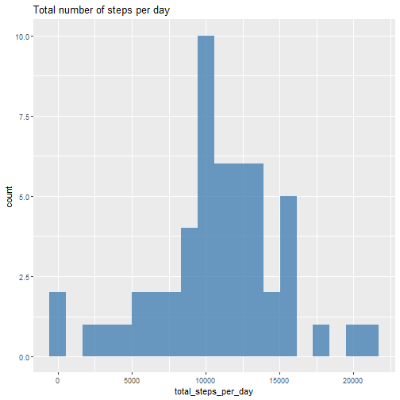

## Loading and preprocessing the data


```r
library(ggplot2)
library(lubridate)

activity_zip <- unzip("activity.zip")
activity <- read.csv("activity.csv")
activity$date <- date(activity$date)
str(activity)
```

```
## 'data.frame':	17568 obs. of  3 variables:
##  $ steps   : int  NA NA NA NA NA NA NA NA NA NA ...
##  $ date    : Date, format: "2012-10-01" "2012-10-01" "2012-10-01" "2012-10-01" ...
##  $ interval: int  0 5 10 15 20 25 30 35 40 45 ...
```

```r
summary(activity)
```

```
##      steps             date               interval     
##  Min.   :  0.00   Min.   :2012-10-01   Min.   :   0.0  
##  1st Qu.:  0.00   1st Qu.:2012-10-16   1st Qu.: 588.8  
##  Median :  0.00   Median :2012-10-31   Median :1177.5  
##  Mean   : 37.38   Mean   :2012-10-31   Mean   :1177.5  
##  3rd Qu.: 12.00   3rd Qu.:2012-11-15   3rd Qu.:1766.2  
##  Max.   :806.00   Max.   :2012-11-30   Max.   :2355.0  
##  NA's   :2304
```


## What is mean total number of steps taken per day?


```r
library(dplyr)
library(tidyr)

#1. Calculate the total number of steps taken per day
activity_agg <- activity %>% 
                group_by(date) %>% 
                mutate(total_steps_per_day = sum(steps, na.rm = TRUE)) %>% 
                drop_na()  %>% select(date, total_steps_per_day) %>% 
                distinct()

#2. Make a histogram of the total number of steps taken each day
ggplot(activity_agg, aes(x=total_steps_per_day)) +
  geom_histogram( bins = 20, alpha=0.8, fill="steelblue") +
  labs(title="Total number of steps per day")
```



```r
#3. Calculate and report the mean and median of the total number of steps taken per day
mean_total <- mean(activity_agg$total_steps_per_day)
mean_total
```

```
## [1] 10766.19
```

```r
median_total <- median(activity_agg$total_steps_per_day)
median_total
```

```
## [1] 10765
```
The mean of the total number of steps taken per day is **1.0766189 &times; 10<sup>4</sup>**, while the median is **10765**.

## What is the average daily activity pattern?

```r
#1. Make a time series plot (i.e. type = "l") of the 5-minute interval (x-axis) and the average number of steps taken, averaged across all days (y-axis)
activity_mean <- activity %>% 
                 group_by(interval) %>% 
                 mutate(mean_steps_per_day =mean(steps, na.rm = TRUE)) %>% 
                 drop_na()  %>% 
                 select(interval, mean_steps_per_day) %>% 
                 distinct()

ggplot(activity_mean, aes(x=interval, y =mean_steps_per_day )) +
  geom_line( alpha=0.8, color="steelblue") +
  labs(title="Average number of steps per intervals", x = "Interval", y = "Number of steps")
```


```r
#2. Which 5-minute interval, on average across all the days in the dataset, contains the maximum number of steps?
max_interval <- activity_mean[which.max(activity_mean$mean_steps_per_day),]
```

The interval **835** contains the maximum number of steps  (**206.1698113**).


## Imputing missing values

```r
#1. Calculate and report the total number of missing values in the dataset 
sum(is.na(activity$steps))
```

```
## [1] 2304
```
The dataset has **2304** NA's.


```r
#2. Devise a strategy for filling in all of the missing values in the dataset. 
#3. Create a new dataset that is equal to the original dataset but with the missing data filled in.
activity_complete <- subset(activity, !is.na(activity$steps))
activity_impute <- activity
index_nas <- is.na(activity_impute$steps)
interval_mean <- tapply(activity_complete$steps, activity_complete$interval, mean, na.rm=TRUE)
activity_impute$steps[index_nas] <- interval_mean[as.character(activity_impute$interval[index_nas])]
```
The strategy I choose for filling in all of the missing values in the dataset is to use the **mean** for that 5-minute interval.


```r
#4. Make a histogram of the total number of steps taken each day and Calculate and report the mean and median total number of steps taken per day. Do these values differ from the estimates from the first part of the assignment? What is the impact of imputing missing data on the estimates of the total daily number of steps?
activity_agg_complete <- activity_impute %>% 
                         group_by(date) %>% 
                         mutate(total_steps_per_day = sum(steps, na.rm = TRUE)) %>% 
                         select(date, total_steps_per_day) %>% distinct()

ggplot(activity_agg_complete, aes(x=total_steps_per_day)) +
  geom_histogram( bins = 20, alpha=0.8, fill="steelblue") +
  labs(title="Total number of steps per day")
```


```r
mean_total_complete <- mean(activity_agg_complete$total_steps_per_day)
mean_total_complete
```

```
## [1] 10766.19
```

```r
median_total_complete <- median(activity_agg_complete$total_steps_per_day)
median_total_complete
```

```
## [1] 10766.19
```

The mean of the total number of steps taken per day is **1.0766189 &times; 10<sup>4</sup>**, while the median is **1.0766189 &times; 10<sup>4</sup>**. both results are very similar compared to the estimates from the first part of the assignment.
From the histogram, we can see that the impact of imputing missing data on the estimates of the total daily number of steps, increase the frequency counts at the center region (close to the mean).


## Are there differences in activity patterns between weekdays and weekends?


```r
#1. Create a new factor variable in the dataset with two levels – “weekday” and “weekend” indicating whether a given date is a weekday or weekend day.
activity_impute$date <- date(activity_impute$date)
activity_impute <- activity_impute %>%
                   mutate(day_type= ifelse(weekdays(activity_impute$date)=="sábado" | weekdays(activity_impute$date)=="domingo", "weekend", "weekday"))

head(activity_impute)
```

```
##       steps       date interval day_type
## 1 1.7169811 2012-10-01        0  weekday
## 2 0.3396226 2012-10-01        5  weekday
## 3 0.1320755 2012-10-01       10  weekday
## 4 0.1509434 2012-10-01       15  weekday
## 5 0.0754717 2012-10-01       20  weekday
## 6 2.0943396 2012-10-01       25  weekday
```

```r
#2. Make a panel plot containing a time series plot (i.e. type = "l") of the 5-minute interval (x-axis) and the average number of steps taken, averaged across all weekday days or weekend days (y-axis). See the README file in the GitHub repository to see an example of what this plot should look like using simulated data.
activity_mean_complete <- activity_impute %>% 
                          group_by(day_type, interval) %>% 
                          mutate(mean_steps_per_day =mean(steps, na.rm = TRUE)) 

ggplot(activity_mean_complete, aes(x = interval , y = mean_steps_per_day, color = day_type)) +
       geom_line() +
       labs(title = "Average daily steps by type of date", x = "Interval", y = "Number of steps") +
       facet_wrap(~day_type, ncol = 1, nrow=2)
```


